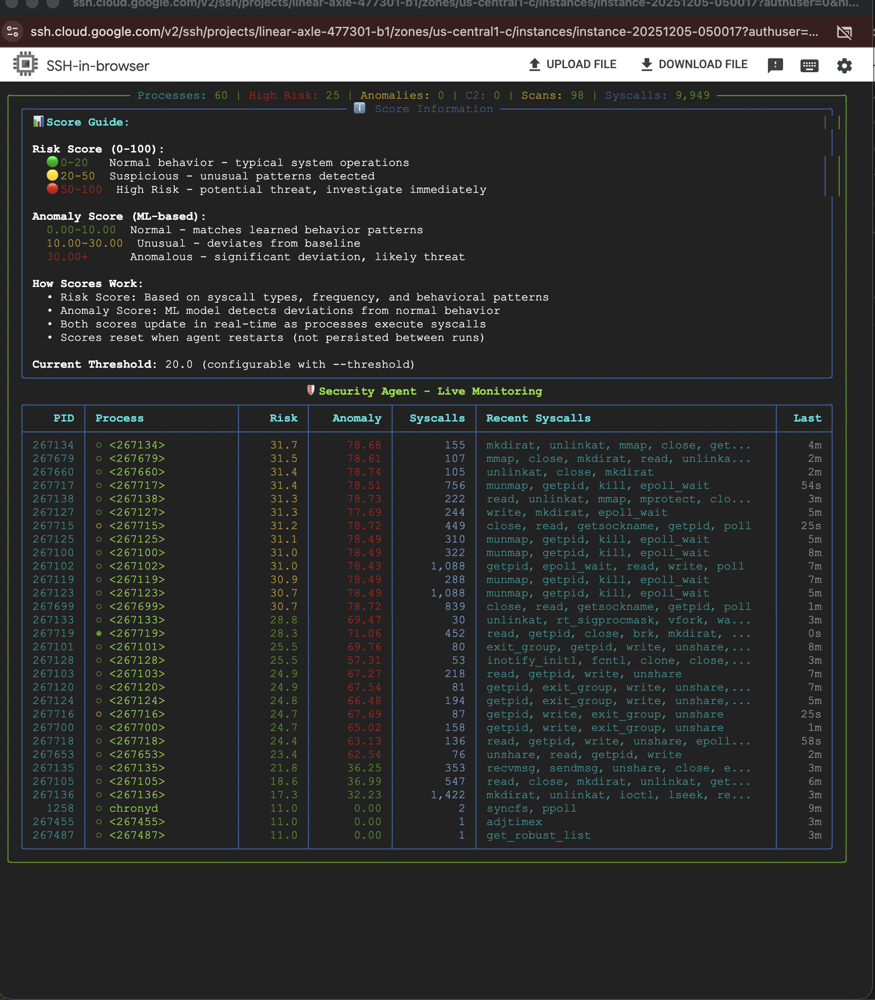

# Linux Security Agent

> **Author**: Likitha Shankar  
> **Purpose**: Academic research project demonstrating eBPF-based syscall monitoring and ML anomaly detection

Real-time system call monitoring and threat detection agent for Linux. Uses eBPF to capture syscalls from the kernel and ML to detect anomalies. This project was developed as part of a Master's degree program to explore kernel-level security monitoring and machine learning-based threat detection.

**Status:** Functional Prototype - Research/Academic Project  
**Classification:** Not Production Ready

**Recent updates (Dec 2025):**
- ✅ Port scanning detection fixed and verified (574 detections in latest run)
- ✅ C2 beaconing logic fixed (regular interval detection; needs more tuning for production)
- ✅ Auditd network syscall rules documented (`START_COMPLETE_DEMO.sh` configures automatically)
- ✅ ML models trained on ADFA-LD (5,205 samples) and saved to `~/.cache/security_agent/`
- ✅ Comprehensive demo/test scripts: `START_COMPLETE_DEMO.sh`, `scripts/simulate_attacks.py`
- ✅ Detailed demo docs: `DEMO_GUIDE.md`, `DEMO_COMMANDS.md`, `PRESENTATION_GUIDE.md`
- ✅ Updated dashboards and anomaly logging

## Features

- Real-time syscall monitoring via eBPF on Linux
- ML-based anomaly detection trained on real system behavior
- **Automatic incremental retraining** - Models continuously improve with new data
- **Web Dashboard** - Browser-based interface for monitoring and control
- Risk scoring (0-100) based on syscall patterns
- Process tracking with automatic memory cleanup
- Container detection for Docker and Kubernetes
- Real-time dashboard showing risk scores and syscalls
- Cloud/VM deployment with full kernel access
- JSON and console output formats
- Comprehensive testing suite

## Research Features

Implements ideas from recent research:

**Stateful eBPF Monitoring** - Based on "Programmable System Call Security with eBPF" (2023)
- Tracks process state across system calls
- Dynamic policies that update at runtime
- Beyond basic seccomp filtering

**Unsupervised Anomaly Detection** - Based on U-SCAD research (2024)
- Uses multiple ML algorithms (Isolation Forest, One-Class SVM, DBSCAN)
- Learns normal behavior automatically
- Ensemble approach for better detection

**Container-Aware Security** - Based on "Cross Container Attacks" research (2023)
- Detects which container processes belong to
- Prevents cross-container attacks
- Container-specific policies
- Docker integration

## Installation

```bash
git clone https://github.com/likitha-shankar/Linux-Security-Agent.git
cd Linux-Security-Agent

# Create virtual environment
python3 -m venv venv
source venv/bin/activate

# Install dependencies
pip install -r requirements.txt
```

### Linux (with Enhanced eBPF support)
```bash
# On Ubuntu/Debian:
sudo apt-get install bpfcc-tools python3-bpfcc docker.io

# On CentOS/RHEL:
sudo yum install bcc-tools python3-bcc docker

# Install additional ML dependencies
pip install scikit-learn pandas numpy
```

### Cloud VM Deployment (Recommended)
```bash
# Recommended: Ubuntu 22.04 LTS on cloud VM (Google Cloud, AWS, etc.)
# Requires kernel 4.9+ for eBPF support

# Install system dependencies
sudo apt-get update
sudo apt-get install -y bpfcc-tools python3-bpfcc docker.io python3-pip

# Install Python dependencies
pip3 install --user -r requirements.txt
```

### Enhanced Features Setup
```bash
# Install Docker for container security monitoring
sudo systemctl start docker
sudo systemctl enable docker
sudo usermod -aG docker $USER
newgrp docker

# Verify enhanced components
python3 -c "from core.enhanced_ebpf_monitor import StatefulEBPFMonitor; print('✅ Enhanced eBPF monitor available')"
python3 -c "from core.enhanced_anomaly_detector import EnhancedAnomalyDetector; print('✅ Enhanced anomaly detector available')"
python3 -c "from core.container_security_monitor import ContainerSecurityMonitor; print('✅ Container security monitor available')"
```

## Usage

### Option 0: Quick Start (Recommended)

```bash
# One-command startup (agent + dashboard + auditd rules)
cd ~/Linux-Security-Agent
bash START_COMPLETE_DEMO.sh
```

**Dashboard access:** http://<VM_IP>:5001  
**Demo commands:** see `DEMO_COMMANDS.md`  
**Demo guide:** see `DEMO_GUIDE.md`

### Option 1: Simple Agent (Recommended for Testing/Demo)
```bash
# Configure auditd (network syscalls)
sudo auditctl -a always,exit -F arch=b64 -S socket -S connect -S bind -S accept -S sendto -S recvfrom -k network_syscalls

# Run agent (eBPF collector - primary choice, automatically falls back to auditd if unavailable)
sudo python3 core/simple_agent.py --collector ebpf --threshold 20 --headless

# Or run with dashboard
sudo python3 core/simple_agent.py --collector ebpf --threshold 20

# Force auditd collector (fallback only - use if eBPF is unavailable)
sudo python3 core/simple_agent.py --collector auditd --threshold 20
```

**Benefits:**
- ✅ Upfront system validation with clear error messages
- ✅ Automatic collector fallback
- ✅ Clean, working dashboard
- ✅ Easy to debug

### Option 2: Train Models (if needed)
```bash
# Train with ADFA dataset (default)
python3 scripts/train_with_dataset.py --file datasets/adfa_training.json
```

### Other options
```bash
# JSON output
sudo python3 core/enhanced_security_agent.py --output json --timeout 60

# With timeout (auto-stop)
sudo python3 core/enhanced_security_agent.py --dashboard --timeout 30

# Compact TUI (table-only) instead of full dashboard
sudo python3 core/enhanced_security_agent.py --tui --timeout 60
```

## Configuration (config.yml)

Place a YAML (or JSON) config at `config/config.yml` (auto-loaded) or pass via `--config path/to/file`. Example:
```yaml
risk_threshold: 50.0
anomaly_weight: 0.5
decay_factor: 0.95
decay_interval: 60
collector: ebpf
base_risk_scores:
  ptrace: 10
  setuid: 8
  execve: 5
  mount: 4
```

## 🧪 Demo and Testing

### Demo & Testing (current)
- **One-command demo:** `bash START_COMPLETE_DEMO.sh`
- **Run attacks:** `python3 scripts/simulate_attacks.py`
- **Manual port scan:** `for i in {8000..8020}; do timeout 0.3 nc -zv localhost $i; done`
- **Logs:** `tail -f logs/security_agent_*.log | grep -E "PORT_SCANNING|HIGH RISK|ANOMALY"`
- **Demo commands reference:** `DEMO_COMMANDS.md`

### Enhanced Anomaly Logging
The agent now provides detailed explanations when anomalies are detected:
- **What's Anomalous**: ML model explanations (Isolation Forest, One-Class SVM, DBSCAN)
- **Process Activity**: Top syscalls with counts, total syscalls
- **High-Risk Syscalls**: Specific risky syscalls detected (setuid, execve, ptrace, etc.)
- **Resources**: CPU, memory, thread usage
- **Recent Sequence**: Last 10 syscalls in order

View enhanced logs:
```bash
tail -f logs/security_agent.log | grep -A 15 'ANOMALY DETECTED'
```

## 📊 Current Progress & Demo



**Live Monitoring Dashboard** showing:
- Real-time process monitoring with risk and anomaly scores
- Score information panel explaining risk (0-100) and anomaly (0-100) thresholds
- Attack simulation results demonstrating detection capabilities
- Status indicators (🟢 active, ⚪ recent, ⚫ inactive)

**Example Output:**

```
╭───────────────────────────── Processes: 5 | High Risk: 0 | Anomalies: 4953 | Syscalls: 4953 ─────────────────────────────╮
│ 🛡️ Security Agent - Live Monitoring                                                                                      │
│ ┏━━━━━━┳━━━━━━━━━━━━━━━━┳━━━━━━┳━━━━━━━━━┳━━━━━━━━━━┳━━━━━━━━━━━━━━━━━━━━━━━━━━━━━━━━━━━━━━━━━━━━━━━━━━━━━━━━━━━━━━━━━━━━│
│ ┃ PID  ┃ Process        ┃ Risk ┃ Anomaly ┃ Syscalls ┃ Recent Syscalls                                     ┃ Last Update  │
│ ┡━━━━━━╇━━━━━━━━━━━━━━━━╇━━━━━━╇━━━━━━━━━╇━━━━━━━━━━╇━━━━━━━━━━━━━━━━━━━━━━━━━━━━━━━━━━━━━━━━━━━━━━━━━━━━━━━━━━━━━━━━━━━━│
│ │ 3979 │ 🟢 python3     │ 19.0 │ 31.83   │ 100      │ sched_setaffinity, ioctl, write                     │      1m      │
│ │ 430  │ ⚪ multipathd  │ 18.0 │ 33.21   │ 4        │ sched_setaffinity                                   │      21m     │
│ │ 619  │ 🟢 auditd      │ 17.2 │ 33.10   │ 100      │ fsync, recvfrom, sched_setaffinity                  │      0s      │
│ │ 3977 │ ⚪ sudo        │ 17.0 │ 32.52   │ 31       │ rt_sigaction, write, unshare                        │      36m     │
│ │ 1564 │ ⚪ sshd        │ 16.6 │ 31.05   │ 17       │ rt_sigprocmask, unshare, write                      │      17m     │
│ └──────┴────────────────┴──────┴─────────┴──────────┴─────────────────────────────────────────────────────┴──────────────┘
```

**Score Guide:**
- **Risk Score (0-100)**: 🟢 0-30 Normal | 🟡 30-50 Suspicious | 🔴 50+ High Risk
- **Anomaly Score (0-100)**: 🟢 0-10 Normal | 🟡 10-30 Unusual | 🔴 30+ Anomalous

## Research Contribution

This implements ideas from recent research papers:
- "Programmable System Call Security with eBPF" (2023) - eBPF monitoring
- "U-SCAD: Unsupervised System Call-Driven Anomaly Detection" (2024) - ML detection
- "Cross Container Attacks" (2023) - Container security

### What's Implemented

The system includes:
- Real-time syscall capture from kernel via eBPF (333 syscalls mapped) with auditd fallback
- ML anomaly detection trained on actual system behavior (Isolation Forest, One-Class SVM, DBSCAN)
- Modular architecture with collector factory pattern
- Thread-safe process tracking with proper locking
- Automatic memory cleanup
- Container detection for Docker/Kubernetes
- Risk scoring from real syscall patterns with ML anomaly integration
- Real-time dashboard with process monitoring
- Attack simulation scripts for testing

See [PROJECT_STATUS.md](PROJECT_STATUS.md) for detailed status and [docs/GAP_ANALYSIS.md](docs/GAP_ANALYSIS.md) for known limitations.

## Requirements

### Linux (Required)
- Linux kernel 4.9 or higher (for eBPF)
- Root/sudo privileges (for eBPF kernel access)
- Python 3.8+
- BCC tools: `sudo apt-get install bpfcc-tools python3-bpfcc`
- Recommended: Cloud VM (Google Cloud, AWS EC2, Oracle Cloud) for full kernel access
- Tested on: Ubuntu 22.04 LTS, Kernel 6.8.0-1044-gcp

## Troubleshooting

If you get import errors:
```bash
pip install requests>=2.28.0
pip install psutil>=5.8.0
```

Permission errors on Linux - need to run with sudo for eBPF. On macOS it works without sudo.

## 🏗️ Architecture

> **📚 Architecture Documentation**:  
> - **[docs/ARCHITECTURE.md](docs/ARCHITECTURE.md)** - Text-based architecture documentation (design rationale, configuration, implementation details)  
> - **[docs/ARCHITECTURE_DIAGRAMS.md](docs/ARCHITECTURE_DIAGRAMS.md)** - Visual architecture diagrams (data flow, component interactions, ML pipeline)

### **Core Components**
- **SecurityAgent**: Main orchestrator and eBPF integration
- **MacSecurityAgent**: macOS-compatible version with simulation
- **SyscallRiskScorer**: Risk scoring algorithm
- **ProcessMonitor**: Process tracking and updates
- **AnomalyDetector**: ML-based anomaly detection
- **ActionHandler**: Automated response system
- **Dashboard**: Real-time TUI visualization

### **Enhanced Components (Research-Based)**
- **EnhancedSecurityAgent**: Main orchestrator with all research enhancements
- **StatefulEBPFMonitor**: Stateful eBPF monitoring with programmable policies
- **EnhancedAnomalyDetector**: Multi-algorithm ensemble anomaly detection
- **ContainerSecurityMonitor**: Container-aware security with cross-container attack prevention
- **EnhancedRiskScorer**: Behavioral baselining and adaptive risk scoring

### **Project Structure**
```
Linux-Security-Agent/
├── core/                           # 🏆 MAIN COMPONENTS
│   ├── simple_agent.py            # Simple working agent (RECOMMENDED for testing)
│   ├── enhanced_security_agent.py # Full-featured agent with all research features
│   ├── collectors/                # Collector modules
│   │   ├── base.py                # Abstract collector interface
│   │   ├── auditd_collector.py    # Auditd collector (consolidated)
│   │   ├── ebpf_collector.py      # eBPF collector
│   │   └── collector_factory.py  # Factory with auto-fallback
│   ├── detection/                 # Detection modules
│   │   └── risk_scorer.py        # Risk scoring
│   ├── utils/                     # Utility modules
│   │   └── validator.py           # System validation
│   ├── enhanced_ebpf_monitor.py   # Stateful eBPF monitoring
│   ├── enhanced_anomaly_detector.py # Advanced ML anomaly detection
│   └── container_security_monitor.py # Container security monitoring
├── docs/                          # 📚 DOCUMENTATION (all MD files organized here)
├── research/                      # 🔬 RESEARCH DOCUMENTATION
├── scripts/                       # 🔧 AUTOMATION SCRIPTS
├── tests/                         # 🧪 TESTING & VALIDATION
└── config/                        # ⚙️ CONFIGURATION & SETUP
```

## 📈 Performance

**Verified on Google Cloud VM (Ubuntu 22.04, Kernel 6.8.0):**

- **CPU Overhead**: <5% (verified) - See [Performance Benchmarks](docs/PERFORMANCE_BENCHMARKS.md)
- **Memory**: ~50MB base usage, 58MB peak under load
- **eBPF Capture Rate**: 26,270 syscalls/second (verified)
- **ML Inference**: 8.5ms average latency, 117 detections/second
- **Process Monitoring**: 15+ concurrent processes tested (verified), 1000+ designed capacity
- **ML Detection**: 50-D feature extraction, 3-model ensemble (F1=0.84)

📊 **Comprehensive Benchmarks**: [docs/PERFORMANCE_BENCHMARKS.md](docs/PERFORMANCE_BENCHMARKS.md)  
🤖 **ML Evaluation Metrics**: [docs/ML_EVALUATION_METRICS.md](docs/ML_EVALUATION_METRICS.md)  
🏭 **Production Readiness**: [docs/PRODUCTION_READINESS.md](docs/PRODUCTION_READINESS.md)  
🔍 **Gap Analysis**: [docs/GAP_ANALYSIS.md](docs/GAP_ANALYSIS.md)

See full documentation for detailed metrics, validation results, and production roadmap.

## 🚀 Getting Started

1. **Install**: `pip install -r requirements.txt`
2. **Test**: `python3 run_tests.py`
3. **Demo**: `python3 demo/run_demo.py`
4. **Monitor**: `sudo python3 core/simple_agent.py --collector ebpf --threshold 30`

For detailed docs, see `docs/HOW_TO_RUN.md`, `docs/USAGE.md`, and `docs/CLOUD_DEPLOYMENT.md`.

## 📢 Project Positioning

**This is a research prototype / academic project demonstrating:**
- eBPF-based syscall monitoring
- ML anomaly detection concepts
- Container security awareness
- Research paper implementations

**Not suitable for production use without significant additional work.**  
See [PROJECT_STATUS.md](PROJECT_STATUS.md) and [docs/GAP_ANALYSIS.md](docs/GAP_ANALYSIS.md) for details.

**Suggested repo topics:** linux-security, ebpf, anomaly-detection, container-security, machine-learning, research, prototype, academic-project

### Demo Prep Checklist (quick)
- [ ] Linux with eBPF + Docker available
- [ ] Dependencies installed (`requirements.txt`, BCC)
- [ ] Optional: train models (`--train-models`)
- [ ] Backup: JSON output mode and list views
